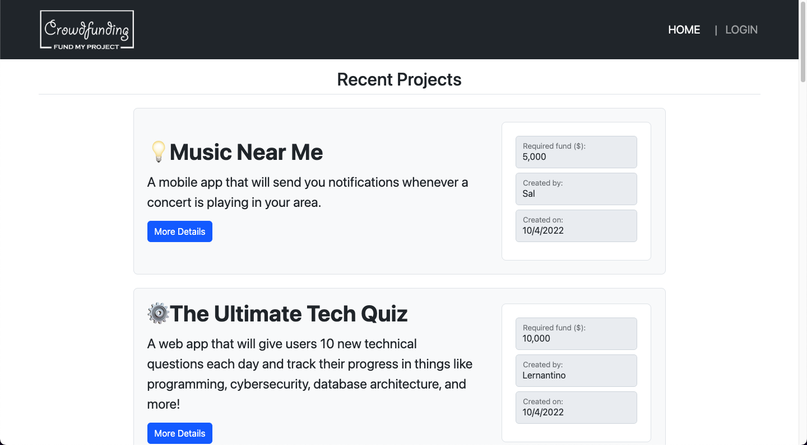
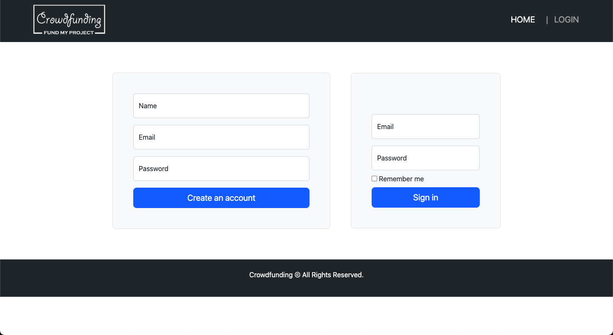

# Events Funding App

The task is to build a full-stack one stop marketplace app for event engineering, planning and execution using Node.js, Express.js, Sequelize, Handlebars.js, and MVC architecture.

##Coding requirements

Must use Node.js and Express.js to create a RESTful API

Must use Handlebars.js as the template engine

Must use MySQL and the Sequelize ORM for the database

Must have both GET and POST routes for retrieving and adding new data

Must use at least one new library, package, or technology that we haven’t discussed

Must have a folder structure that meets the MVC paradigm

Must include authentication (express-session and cookies) 

Must protect API keys and sensitive information with environment variables

Must be deployed using Heroku (with data)

Must have a polished UI

Must be responsive

Must be interactive (i.e., accept and respond to user input)

Must meet good-quality coding standards (file structure, best practices, etc.)

Must have a professional README (unique name, description, link to the deployed app)

## User Stories

* As a user, I want to see a list of current Events seeking funding.

* As a user, I want to be able to create an account.

* As a registered user, I want to post my own event to ask for funding.

* As a registered user, I want to make payment for my own event using a payment gateway.

### Acceptance Criteria

* It's done when the `/` homepage route renders a list of all projects from the database.

* It's done when the `/project/:id` route renders an individual project's details based on the route parameter id.

* It's done when the `/login` route renders a form to log in and a form to create a new account.

* It's done when an existing user can enter their credentials on the login page to create a session on the server.

* It's done when a new user can create an account on the login page and then be immediately logged in with a session.

* It's done when the `/profile` route renders the logged-in user's projects and a form to create a new project.

* It's done when only a logged in user can visit the `/profile` route.

* It's done when a logged in user is redirected to `/profile` when they try to visit `/login` again.

* It's done when a user on the profile page can use the form to create a new event in the database.

* It's done when a user on the profile page can select a "Delete" button to remove their project from the database.

* It's done when a logged-in user can select a "Logout" button to remove their session.

* It's done when the API routes to create and delete posts are protected from non logged-in users.

* It's done when the code is organized using MVC architecture.

* It's done when the views are rendered with Handlebars.js templates.

### App Screenshots

### Link to elevator pitch (YouTube)

https://www.youtube.com/watch?v=oEjAeOjo0c0

### App Github Repository Link

https://github.com/Trebligony/Event-Funding-App

### App Heroku Deploy Link

https://events-funding-app.herokuapp.com/

## References 

https://stripe.com/docs/api/payment_methods

